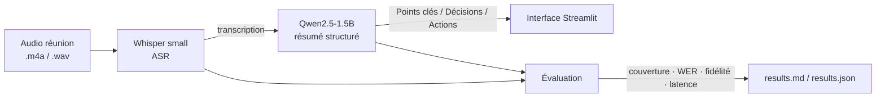

# 🎙️ Meeting Summary — Pipeline ASR + LLM avec évaluation automatique

Transcription d'une réunion (**Whisper**) → compte-rendu structuré (**Qwen**) →
**évaluation automatique** de la qualité (couverture, fidélité/hallucinations,
WER, latence), le tout servi via une petite interface **Streamlit**.

> Projet personnel motivé par une offre d'alternance sur l'analyse de réunions
> par ASR + LLM. L'enjeu n'était pas seulement de faire tourner un pipeline,
> mais de **mesurer** sa qualité de façon reproductible sur plusieurs réunions.

---

## Architecture



Audio → **Whisper (ASR)** → texte → **Qwen (LLM)** → résumé en 3 sections
(Points clés / Décisions / Actions) → **module d'évaluation** → rapport chiffré.

---

## Résultats

Campagne d'évaluation sur **7 réunions (~6,5 min d'audio)**, jeu de test varié
(comité budget, daily dev, point client, revue de sprint, rétrospective,
incident sécurité, planning recrutement).

*(Tableau généré automatiquement par `evaluate.py` → `results.md`. Chiffres à
insérer après exécution sur GPU Colab.)*

| Métrique | Valeur |
|---|---|
| Couverture moyenne des points clés | `__ %` |
| WER moyen (qualité de transcription) | `__ %` |
| Fidélité moyenne (LLM-as-judge, /5) | `__ / 5` |
| Taux d'hallucination (note < 4/5) | `__ %` |
| Latence médiane par réunion | `__ s` |

Le détail par réunion (couverture point par point, transcription, résumé
généré) est dans `results.json`.

---

## Exemple entrée → sortie

**Extrait de transcription (Whisper) :**
> « … on a décidé d'augmenter l'enveloppe marketing de cinq mille euros pour la
> campagne de rentrée … la démo produit prévue le quinze septembre : on la
> reporte au vingt-deux septembre … Karim, tu prends le bug sur le calcul des
> frais … »

**Résumé structuré (Qwen) :**
```
## Points clés
- Point budget trimestriel de l'équipe.

## Décisions
- Budget marketing augmenté de 5 000 € pour la campagne de rentrée.
- Démo produit reportée du 15 au 22 septembre (recette non prête).

## Actions à faire
- Karim : corriger le bug du calcul des frais (priorité vendredi).
- Sarah : préparer la démo du 22/09 et inviter les clients.
- Contacter l'hébergeur pour la migration avant fin du mois.
```

---

## Méthodologie d'évaluation

C'est la partie qui distingue ce projet d'un simple « appel à un modèle ».
Chaque réunion possède une **vérité de référence** (`meetings.json`) listant les
points qui *doivent* apparaître. Quatre métriques :

- **Couverture (%)** — part des points attendus (décisions, actions) réellement
  présents dans le résumé. Mesure si le pipeline n'oublie rien d'important.
- **WER (%)** — *Word Error Rate*, distance de Levenshtein mot à mot entre la
  transcription Whisper et la transcription de référence. Mesure la qualité de
  l'ASR.
- **Fidélité (/5)** — un LLM-juge note si le résumé invente des informations
  absentes de la transcription (détection d'**hallucinations**).
- **Latence (s)** — temps ASR + temps résumé, par réunion.

Tout est agrégé sur les 7 réunions pour donner des chiffres stables plutôt
qu'une impression sur un seul exemple.

---

## Reproduire

Le pipeline nécessite un GPU → utiliser **Google Colab** (Exécution → GPU T4).

1. Enregistrer (ou générer) un court audio par script de `scripts/`, le déposer
   dans `audio/` sous le nom attendu par `meetings.json`.
2. Installer : `pip install -r requirements.txt`
3. Lancer l'évaluation complète :
   ```bash
   python evaluate.py        # produit results.md et results.json
   ```
4. Tester la logique **sans GPU** (sorties factices) :
   ```bash
   USE_MOCK=1 python evaluate.py
   ```

Interface de démonstration : `streamlit run app.py`.

---

## Structure

```
meeting-summary-eval/
├── app.py              # interface Streamlit (upload audio → résumé)
├── backends.py         # Whisper + Qwen (branchables, mode mock inclus)
├── evaluate.py         # harnais d'évaluation multi-réunions
├── meetings.json       # jeu de test + vérité de référence (7 réunions)
├── scripts/            # transcriptions de référence (pour l'audio et le WER)
├── audio/              # enregistrements (non versionnés)
├── results.md          # rapport chiffré (généré)
└── requirements.txt
```

---

## Limites & pistes

- Modèles volontairement légers (`whisper-small`, `Qwen2.5-1.5B`) pour tenir sur
  un GPU gratuit → des modèles plus gros amélioreraient WER et fidélité.
- Le juge de fidélité est le même modèle que le résumeur ; un juge tiers plus
  puissant serait plus fiable.
- Jeu de test en français, réunions courtes et scriptées → étape suivante :
  audios réels plus longs et multi-locuteurs (diarisation).

## Note d'honnêteté

Les réunions du jeu de test sont **scriptées puis enregistrées** pour disposer
d'une vérité de référence exacte (indispensable pour mesurer couverture et WER).
La démarche et les métriques sont réelles ; seul le contenu des réunions est
fabriqué, pour des raisons évidentes de confidentialité.
